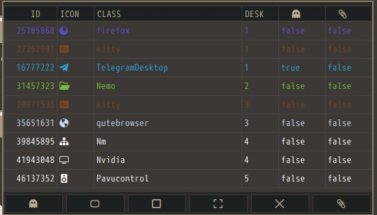

# nodesman
nodesman é um script posix que ajuda a controlar as janelas no bspwm, ajuda a usar menos o terminal para tarefas como minizar(esconder) a janela, alterar entre fullscreen, tiled e floating, focar uma janela, e até mesmo para ter um paronama geral das janelas abertas.
###### [requer yad](https://github.com/v1cont/yad)
**Uso :**
###### Inciar o programa :
```dash
nds start
```
###### Parar o programa :
```dash
nds stop
```
###### Chamar a janela com as informações :
```
nds
```


